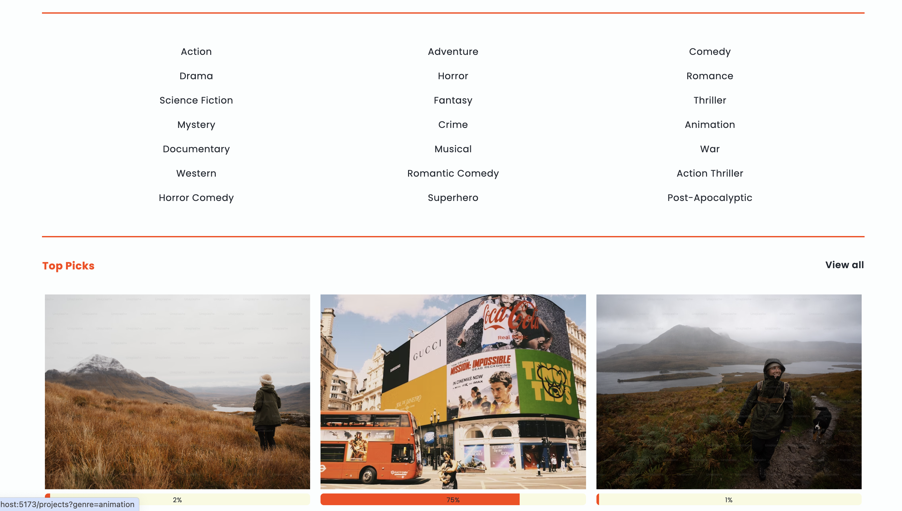
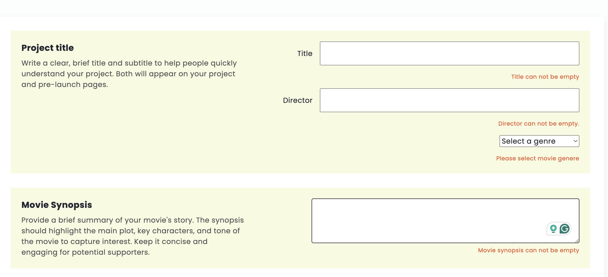

# Movie Crowdfunding App

---

## Overview

[MakeCine Website](https://makecine.netlify.app/)

The **MakeCine** is a platform where users can create crowdfunding campaigns for their movie projects, make pledges, and track funding progress. The app allows users to:

- **Create projects** with detailed information about their movies.
- **Pledge** to support projects while choosing to remain anonymous if desired.
- **View projects** with visual progress indicators and detailed descriptions.

---

## Features

1. **User Authentication:**

   - Secure login and signup functionality.
   - Protected routes for creating pledges and projects.

2. **Project Management:**

   - Create, edit, and delete movie crowdfunding projects.
   - Add information like title, director, genres, funding goal, deadlines, and a synopsis.

3. **Pledge System:**

   - Support projects by pledging an amount.
   - Option to pledge anonymously.

4. **Dynamic Progress Tracking:**

   - Visual representation of funds raised vs. the funding goal.

5. **Form Validation:**

   - Ensure valid and required data before submission:
     - **Project Creation Form**:
       - Title, director, synopsis, funding goal, genres, and deadline are required.
       - Funding goal must be a positive number.
     - **Pledge Form**:
       - Amount must be a positive number.
       - Comment is required.
       - Anonymous must be set to "true" or "false".
   - Error messages are displayed inline for user-friendly feedback.

---

## Technologies Used

### Frontend:

- React.js
- React Router DOM
- Custom Components: `InputField`, `Button`, `SelectBox`
- CSS Modules for component styling

### Backend API (assumed):

- Node.js / Django

### State Management:

- React Hooks (`useState`, `useEffect`)
- Custom Hooks (`useAuth`, `useProject`)

---

## Usage

1. **Creating a Project**:

   - Navigate to the "Start a Project" page.
   - Fill out the form with movie details (title, director, goal, synopsis).
   - Submit the form to create a new project.

2. **Pledging**:

   - Visit a project's detail page.
   - Click on "Make a Pledge" and enter the pledge amount, comment, and anonymity preference.

3. **Editing or Deleting Projects**:
   - Project owners can use the dropdown to edit or delete their projects.

---

## Screenshots

Filter movies by genre

Form validation


---

## Future Enhancements

- **User Profiles**: Enable users to manage their created projects and pledges.
- **Search and Filter**: Add functionality to filter projects by genre or funding status.
- **Responsive design**: Enable reponsive design for mobile and small screen users

## Setup Instructions


### Steps:

1. **Clone the Repository**:

   ```bash
   git clone https://github.com/yeskwonny/crowdfunding_front_end.git

   ```

2. **Install Dependencies**:

   ```bash
   npm install
   ```

3. **Configure Environment Variables**:

4. **Start the Development Server**:
   ```bash
   npm run dev
   ```

---
